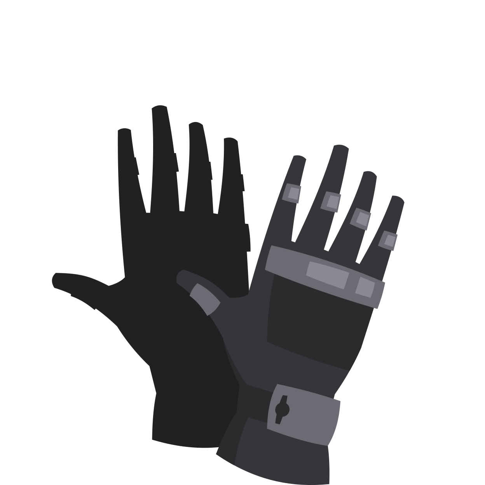
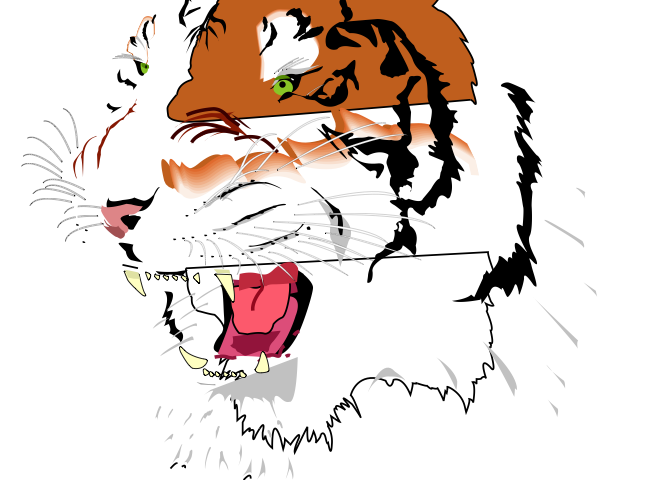
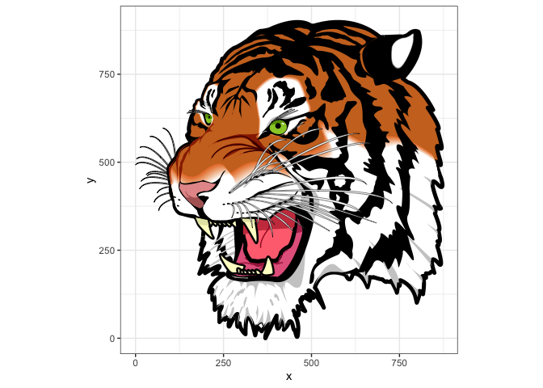
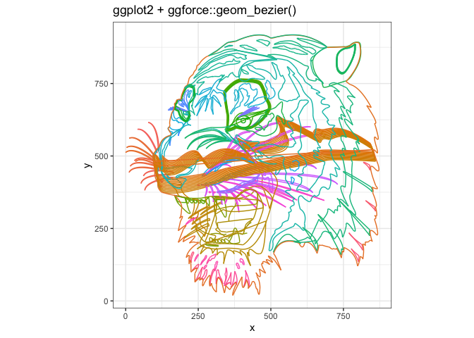
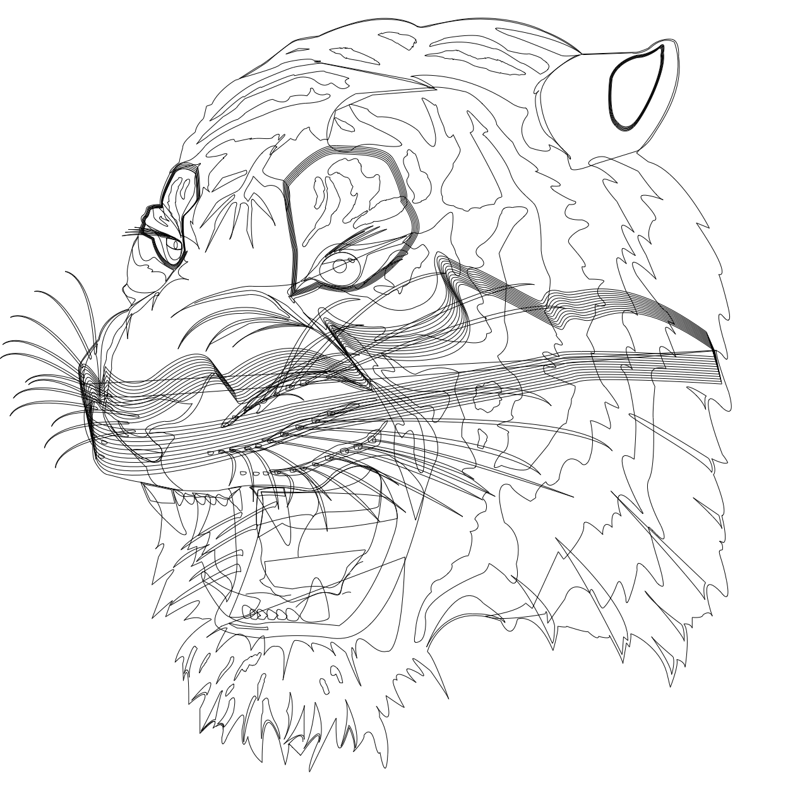

<!-- README.md is generated from README.Rmd. Please edit that file -->

# nanosvgr

<!-- badges: start -->


[](https://github.com/coolbutuseless/nanosvgr-dev/actions/workflows/R-CMD-check.yaml)
[](https://CRAN.R-project.org/package=nanosvgr)
<!-- badges: end -->

`nanosvgr` reads SVG images as geometry constructed from cubic beziers
using the [`nanosvg` C library](https://github.com/memononen/nanosvg).

The beziers are further processed into polylines for easier manipulation
and plotting.

Possible future features

- Implement bezier-to-lines conversion in C.
- Add support for radial and linear gradients in `nsvg_to_grob()`. I’m
  unsure that `nanosvg` library returns enough information to do this
  properly.

Limitations:

- `plot.nsvg()` does not respect radial/linear gradients
- No support for SVG `<text>` in `nanosvg` library

## Installation

<!-- This package can be installed from CRAN -->

<!-- ``` r -->

<!-- install.packages('nanosvgr') -->

<!-- ``` -->

You can install the latest development version from
[GitHub](https://github.com/coolbutuseless/nanosvgr) with:

``` r
# install.package('remotes')
remotes::install_github('coolbutuseless/nanosvgr')
```

<!-- Pre-built source/binary versions can also be installed from -->

<!-- [R-universe](https://r-universe.dev) -->

<!-- ``` r -->

<!-- install.packages('nanosvgr', repos = c('https://coolbutuseless.r-universe.dev', 'https://cloud.r-project.org')) -->

<!-- ``` -->

## `nsvg` object format

An `nsvg` object read from an SVG file using `nsvg_read()` is simply a
data.frame of geometric information and associated graphical parameters.

- Each row of the `nsvg` data.frame is one *shape* in the SVG
  - Each *shape* is made up of one-or-more *paths*
    - Each *path* is made up of one-or-more *cubic beziers*
      - Each *cubic bezier* is defined by 4 control points.

The columns in the `nsvg` data.frame are as follows:

- `shape_idx` - Shape index. Each SVG is defined as a number of shapes,
  with each shape having a number of paths
- `fill` - fill color
- `stroke` - stroke color
- `alpha` - opacity in range \[0, 1\]
- `lwd` - line width
- `linejoin`- Line join style. ‘bevel’, ‘mitre’ or ‘round’
- `lineend` - Line end style. ‘round’, ‘butt’, ‘square’
- `linemitre` - Line mitre limit
- `linedash` - Raw list of line dash lengths for each shape
- `fill_rule` - ‘evenodd’ or ‘winding’
- `fill_type` - ‘flat’, ‘linear’, ‘radial’, ‘none’, ‘undef’
- `gradient` - Radial or linear gradient information for this shape
- `stroke_type` - ‘flat’, ‘linear’, ‘radial’, ‘none’, ‘undef’
- `beziers` - A list of data.frames - one data.frame for each shape
  containing the coordinates of the bezier control points (Note: there
  are 4 control points for each cubic bezier).
  - `path_idx` - Index of path within shape
  - `bez_idx` - Index of bezier with path
  - `closed` - Is the path closed?
  - `x` - x coordinate of bezier control points
  - `y` - y coordinate of bezier control points
- `lty` - Line type. Either ‘solid’ or a string of up to 8 characters
  (from c(1:9, “A”:“F”)) may be given, giving the length of line
  segments which are alternatively drawn and skipped. See
  `?graphics::par` for deails on Line Type Specification
- `points` - A list of data.frames - one data.frame for each shape
  containing the polylines derived from the beziers. Data is the same as
  `beziers` except the coordinates are for the polylines derived from
  the beziers

## Reading an SVG

``` r
library(nanosvgr)
library(tibble)

nsvg <- nsvg_read("man/figures/tiger.svg")
class(nsvg)
```

    #> [1] "nsvg"       "tbl_df"     "tbl"        "data.frame"

``` r
# An 'nsvg' object consists of 
#   * raw geometry for the shapes
#   * graphical parameters e.g. fill color, stroke color etc
names(nsvg)
```

    #>  [1] "shape_idx"   "fill"        "stroke"      "alpha"       "lwd"        
    #>  [6] "linejoin"    "lineend"     "linemitre"   "linedash"    "fill_rule"  
    #> [11] "fill_type"   "gradient"    "stroke_type" "beziers"     "lty"        
    #> [16] "points"

``` r
# The geometry data consists of a number of shapes.
# Each shape consists of 1-or-more paths 
# Each path may be open or closed (i.e. a line or a polygon)
# Each path is defined by one or more beziers
print(nsvg, width = Inf)
```

    #> # A tibble: 239 × 16
    #>    shape_idx fill      stroke    alpha   lwd linejoin lineend linemitre
    #>        <int> <chr>     <chr>     <dbl> <dbl> <chr>    <chr>       <dbl>
    #>  1         1 #FFFFFFFF #000000FF     1 0.304 mitre    butt            4
    #>  2         2 #FFFFFFFF #000000FF     1 0.304 mitre    butt            4
    #>  3         3 #FFFFFFFF #000000FF     1 0.304 mitre    butt            4
    #>  4         4 #FFFFFFFF #000000FF     1 0.304 mitre    butt            4
    #>  5         5 #FFFFFFFF #000000FF     1 0.304 mitre    butt            4
    #>  6         6 #FFFFFFFF #000000FF     1 0.304 mitre    butt            4
    #>  7         7 #FFFFFFFF #000000FF     1 0.304 mitre    butt            4
    #>  8         8 #FFFFFFFF #000000FF     1 0.304 mitre    butt            4
    #>  9         9 #FFFFFFFF #000000FF     1 0.304 mitre    butt            4
    #> 10        10 #FFFFFFFF #000000FF     1 0.304 mitre    butt            4
    #>    linedash  fill_rule fill_type gradient stroke_type beziers           lty  
    #>    <list>    <chr>     <chr>     <list>   <chr>       <list>            <chr>
    #>  1 <dbl [0]> winding   flat      <NULL>   flat        <tibble [16 × 5]> solid
    #>  2 <dbl [0]> winding   flat      <NULL>   flat        <tibble [16 × 5]> solid
    #>  3 <dbl [0]> winding   flat      <NULL>   flat        <tibble [16 × 5]> solid
    #>  4 <dbl [0]> winding   flat      <NULL>   flat        <tibble [16 × 5]> solid
    #>  5 <dbl [0]> winding   flat      <NULL>   flat        <tibble [16 × 5]> solid
    #>  6 <dbl [0]> winding   flat      <NULL>   flat        <tibble [16 × 5]> solid
    #>  7 <dbl [0]> winding   flat      <NULL>   flat        <tibble [16 × 5]> solid
    #>  8 <dbl [0]> winding   flat      <NULL>   flat        <tibble [16 × 5]> solid
    #>  9 <dbl [0]> winding   flat      <NULL>   flat        <tibble [16 × 5]> solid
    #> 10 <dbl [0]> winding   flat      <NULL>   flat        <tibble [16 × 5]> solid
    #>    points       
    #>    <list>       
    #>  1 <df [80 × 5]>
    #>  2 <df [80 × 5]>
    #>  3 <df [80 × 5]>
    #>  4 <df [80 × 5]>
    #>  5 <df [80 × 5]>
    #>  6 <df [80 × 5]>
    #>  7 <df [80 × 5]>
    #>  8 <df [80 × 5]>
    #>  9 <df [80 × 5]>
    #> 10 <df [80 × 5]>
    #> # ℹ 229 more rows

``` r
# The beziers for each path are defined by 4 x-coordinates and 4 y-coordinates.
# THe beziers for each path are collected in a list of data.frames in
# the column "beziers"
nsvg$beziers[[1]]
```

    #> # A tibble: 16 × 5
    #>    path_idx bez_idx closed     x     y
    #>       <int>   <int> <lgl>  <dbl> <dbl>
    #>  1        1       1 TRUE   109.   404.
    #>  2        1       1 TRUE   109.   404.
    #>  3        1       1 TRUE   109.   407.
    #>  4        1       1 TRUE   108.   407.
    #>  5        1       2 TRUE   108.   407.
    #>  6        1       2 TRUE   106.   407.
    #>  7        1       2 TRUE    77.2  322.
    #>  8        1       2 TRUE    40.9  326.
    #>  9        1       3 TRUE    40.9  326.
    #> 10        1       3 TRUE    40.9  326.
    #> 11        1       3 TRUE    72.3  313.
    #> 12        1       3 TRUE   109.   404.
    #> 13        1       4 TRUE   109.   404.
    #> 14        1       4 TRUE   109.   404.
    #> 15        1       4 TRUE   109.   404.
    #> 16        1       4 TRUE   109.   404.

## Plotting with `nsvg`

``` r
nsvg <- nsvg_read("man/figures/tiger.svg")
grid::grid.newpage(); plot(nsvg)
```


``` r
nsvg <- nsvg_read("inst/gloves.svg") |> nsvg_invert_closedness()
grid::grid.newpage(); plot(nsvg)
```



## Example of geometry manipulation

As we now have access to the geometry of the SVG we can manipulate it
prior to plotting.

``` r
nsvg <- nsvg_read("man/figures/tiger.svg") |> nsvg_scale(0.3)
nsvg <- nsvg_explode(nsvg, scale = 1.75)
grid::grid.newpage(); plot(nsvg)
```



## Plotting with grid

``` r
library(nanosvgr)
library(grid)

nsvg   <-  nsvg_read("man/figures/tiger.svg")
points <- nsvg_unnest_points(nsvg, gpars = TRUE)

grid::grid.newpage()
dfs <- split(points, points$shape_idx)
for (i in seq_along(dfs)) {
  df <- dfs[[i]]
  if (df$closed[1]) {
    grid.polygon(df$x, df$y, 
                 default.units = 'points', 
                 gp = gpar(col = nsvg$stroke[i], fill = nsvg$fill[i]))
  } else {
    grid.polyline(df$x, df$y, 
                 default.units = 'points', 
                 gp = gpar(col = nsvg$stroke[i], fill = nsvg$fill[i]))
  }
}
```


## Plotting with ggplot

``` r
library(nanosvgr)
library(ggplot2)

nsvg   <-  nsvg_read("man/figures/tiger.svg")
points <- nsvg_unnest_points(nsvg, gpars = TRUE)
dfs    <- split(points, points$shape_idx)

p <- ggplot(points)

for (i in seq_along(dfs)) {
  df <- dfs[[i]]
  if (df$closed[1]) {
    p <- p + geom_polygon(data = df, aes(x, y, group = shape_idx, fill = I(fill), col = I(stroke), linewidth = I(lwd)))

  } else {
    p <- p + geom_path(data = df, aes(x, y, group = shape_idx, col = I(stroke)))
  }
}

p + 
  theme_bw() + 
  coord_equal()
```



## Plotting raw beziers with `{ggforce}`

``` r
library(nanosvgr)
library(ggplot2)
library(ggforce)

nsvg    <- nsvg_read("man/figures/tiger.svg")
beziers <- nsvg_unnest_beziers(nsvg)

ggplot(beziers) +
  geom_bezier(aes(x, y, group = interaction(shape_idx, path_idx, bez_idx), color = as.factor(shape_idx))) +
  labs(
    title = "ggplot2 + ggforce::geom_bezier()"
  ) +
  theme_bw() +
  coord_equal() +
  theme(legend.position = 'none')
```



## Plotting raw beziers with `grid.bezier()`

``` r
library(nanosvgr)
library(grid)

nsvg    <- nsvg_read("man/figures/tiger.svg")
beziers <- nsvg_unnest_beziers(nsvg)
beziers <- split(beziers, with(beziers, interaction(shape_idx, path_idx, bez_idx, drop = TRUE)))

grid.newpage()
for (bezier in beziers) {
  grid.bezier(bezier$x, bezier$y, default.units = 'points')
}
```


